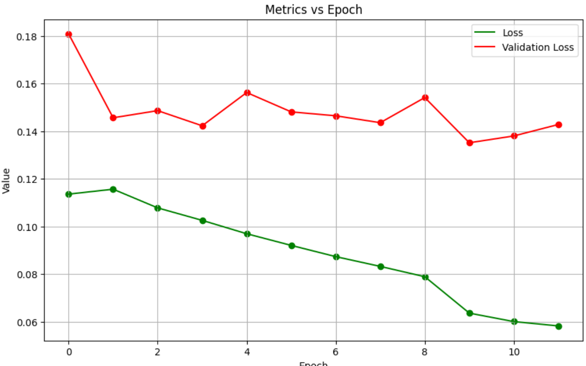
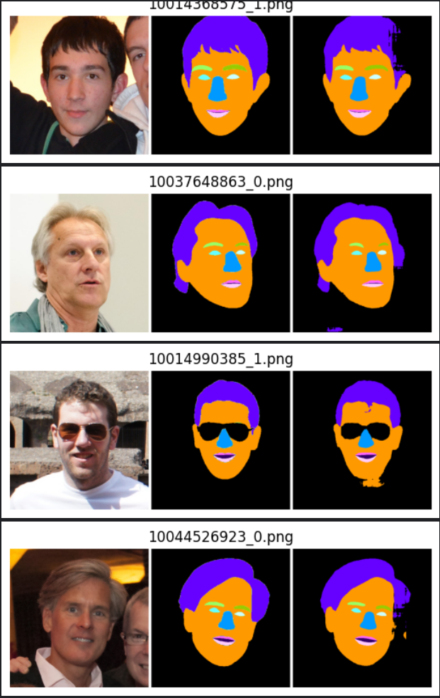
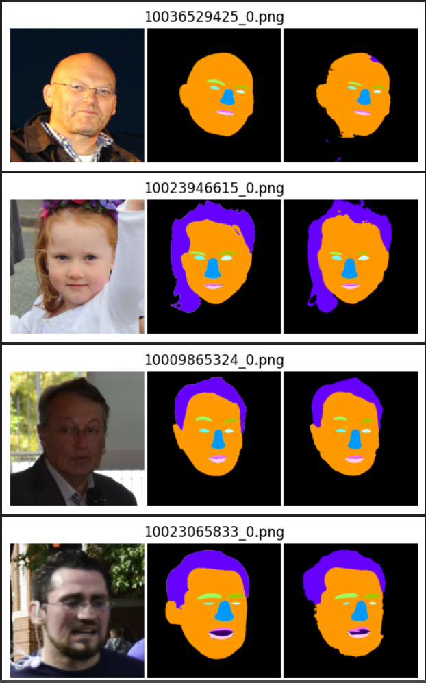

<div align="center">

# 🎨 AI-Powered Image Editor

### Advanced Deep Learning Image Editing Application

[](https://www.python.org/downloads/)
[](https://opencv.org/)
[](https://www.tensorflow.org/)
[](LICENSE)

[Features](#-features) • [Demo](#-demo) • [Models](#-deep-learning-models) • [Installation](#-installation) • [Usage](#-usage) • [Results](#-results)

</div>

---

## 📋 Overview

A powerful **desktop image editing application** that combines traditional image manipulation tools with cutting-edge deep learning models. Built with Python and Tkinter, this application provides an intuitive interface for both basic and advanced image editing tasks, including AI-powered facial feature modification and intelligent background replacement.

### ✨ Highlights

- 🧠 **AI-Powered Editing** - Leverage deep learning for intelligent image segmentation
- 🎭 **Facial Feature Modification** - Change hair, eye, lip, and eyebrow colors with precision
- 🖼️ **Smart Background Replacement** - Automatically segment humans and replace backgrounds
- 🎨 **Rich Filter Library** - Apply professional filters and effects
- 🖱️ **User-Friendly GUI** - Intuitive interface built with CustomTkinter
- ⚡ **Real-time Preview** - See changes instantly as you edit

---

## 🚀 Features

### Basic Image Editing
- ✂️ **Crop & Rotate** - Precise image cropping and rotation at any angle
- 🎨 **Drawing Tools** - Free-hand drawing with customizable pen colors and sizes
- 🌈 **Filters & Effects** - Black & white, blur, emboss, sharpen, edge detection, and more
- 💡 **Adjustments** - Brightness, contrast, blur, and lens distortion controls
- 🔄 **Transform** - Flip horizontally/vertically, zoom in/out
- 📐 **Binary Conversion** - Convert images to binary/threshold format

### Advanced AI Features

#### 🎭 Facial Feature Color Modification
Powered by **U-Net architecture** trained on the LAPA dataset:
- 💇 Hair color transformation
- 👄 Lip color adjustment
- 👁️ Eye color modification
- ✏️ Eyebrow color change
- 🎨 Skin tone adjustment

#### 🌄 Intelligent Background Replacement
Powered by **ResNet50 architecture**:
- Automatic human segmentation
- Clean background removal
- Seamless background replacement

### Creative Tools
- 🔤 **ASCII Art Converter** - Transform images into ASCII art (colored or monochrome)
- 🖼️ **Photo Mosaic Generator** - Create stunning photo mosaics from your images

---

## 🎬 Demo

### Facial Feature Transformations

<div align="center">

| Feature | Before → After |
|---------|----------------|
| **Hair Color** |  |
| **Lip Color** |  |
| **Eyebrow Color** |  |
| **Eye Color** |  |

</div>

### Background Replacement

<div align="center">

</div>

---

## 🧠 Deep Learning Models

### 1. Facial Feature Segmentation Model

**Architecture:** U-Net  
**Dataset:** LAPA (LAndmark guided face PArsing)  
**Purpose:** Precise segmentation of facial features for color modification

#### Model Performance

<div align="center">

| Training Results | Validation Results |
|:----------------:|:------------------:|
|  |  |

</div>

#### Segmentation Results

<div align="center">




</div>

### 2. Human Segmentation Model

**Architecture:** ResNet50  
**Purpose:** Separate human subjects from backgrounds for intelligent background replacement

#### Segmentation Examples

<div align="center">

| Original | Segmented |
|:--------:|:---------:|
|  |  |

</div>

---

## 💻 Installation

### Prerequisites

- Python 3.8 or higher
- pip package manager

### Setup Instructions

1. **Clone the repository**
```bash
git clone https://github.com/nhatky160103/project2.git
cd project2
```

2. **Install required dependencies**
```bash
pip install -r requirements.txt
```

3. **Download pre-trained models**

Place the model files in the `models/` directory:
- Facial segmentation model (U-Net)
- Human segmentation model (ResNet50)

4. **Run the application**
```bash
python main.py
```

### Required Dependencies

```
tkinter
customtkinter
Pillow
numpy
opencv-python
tensorflow / pytorch (depending on model implementation)
```

---

## 🎯 Usage

### Quick Start

1. **Launch the application**
   ```bash
   python main.py
   ```

2. **Open an image**
   - Click "Open Image" button in the toolbar
   - Or use File → New Image from the menu

3. **Apply edits**
   - **Filters:** Select from Custom menu → Apply filter
   - **Face Color:** Navigate to Change → Color
   - **Background:** Navigate to Change → Background
   - **Rotate/Crop:** Use Custom menu options
   - **ASCII/Mosaic:** Access through Tools menu

4. **Save your work**
   - Click "Save Image" or use File → Save

### Interface Overview

- **Left Panel:** Main toolbar with quick access to open/save functions and custom editing options
- **Center Canvas:** Main editing area with real-time preview
- **Right Panel:** 
  - Original image preview (top)
  - Appearance mode toggle (bottom)
  - UI scaling controls (bottom)
- **Menu Bar:** Comprehensive access to all features

---

## 📊 Results

### Key Achievements

✅ **High Accuracy** - Achieved excellent segmentation accuracy on facial features  
✅ **Real-time Performance** - Fast inference for smooth user experience  
✅ **Robust Segmentation** - Works well on diverse facial features and backgrounds  
✅ **Professional Quality** - Production-ready output suitable for professional use

### Model Statistics

- **Facial Segmentation Model:** Trained on LAPA dataset with strong performance on validation set
- **Background Segmentation Model:** ResNet50-based architecture achieving accurate human silhouette extraction

---

## 🛠️ Technical Stack

- **GUI Framework:** Tkinter, CustomTkinter
- **Image Processing:** OpenCV, Pillow
- **Deep Learning:** TensorFlow/PyTorch
- **Numerical Computing:** NumPy
- **Model Architectures:** U-Net, ResNet50

---

## 📁 Project Structure

```
project2/
├── main.py                      # Main application entry point
├── ascii.py                     # ASCII art conversion
├── photomosaic.py              # Photo mosaic generation
├── filter.py                   # Image filters and effects
├── change_color.py             # Facial feature color modification
├── change_background.py        # Background replacement
├── cut_rotate.py               # Crop, rotate, zoom functions
├── draw.py                     # Drawing tools
├── help.py                     # Help and documentation
├── models/                     # Pre-trained model weights
│   ├── face_segmentation/
│   └── human_segmentation/
├── results/                    # Training results and metrics
├── test_image/                 # Sample test images
└── README.md                   # This file
```

---

## 🎓 Learning Outcomes

This project demonstrates:

- ✅ Practical application of **deep learning** in image editing
- ✅ Implementation of **U-Net** and **ResNet** architectures
- ✅ Integration of **AI models** into desktop applications
- ✅ **GUI development** with Python
- ✅ **Computer vision** techniques using OpenCV
- ✅ Model training and **fine-tuning** on specialized datasets

---

## 🔮 Future Enhancements

- [ ] Add more AI-powered features (style transfer, object removal)
- [ ] Implement batch processing for multiple images
- [ ] Add support for video editing
- [ ] Create web-based version
- [ ] Improve model accuracy with additional training data
- [ ] Add undo/redo functionality
- [ ] Support for additional image formats

---

## 📄 License

This project is licensed under the MIT License - see the [LICENSE](LICENSE) file for details.

---

## 👤 Author

**Nhat Ky**
- GitHub: [@nhatky160103](https://github.com/nhatky160103)
- Project Link: [https://github.com/nhatky160103/project2](https://github.com/nhatky160103/project2)

---

## 🙏 Acknowledgments

- **LAPA Dataset** - For providing high-quality facial parsing dataset
- **U-Net Architecture** - Ronneberger et al.
- **ResNet Architecture** - He et al.
- Open-source community for amazing tools and libraries

---

<div align="center">

### ⭐ Star this repository if you find it helpful!

**Made with ❤️ and AI**

</div>
