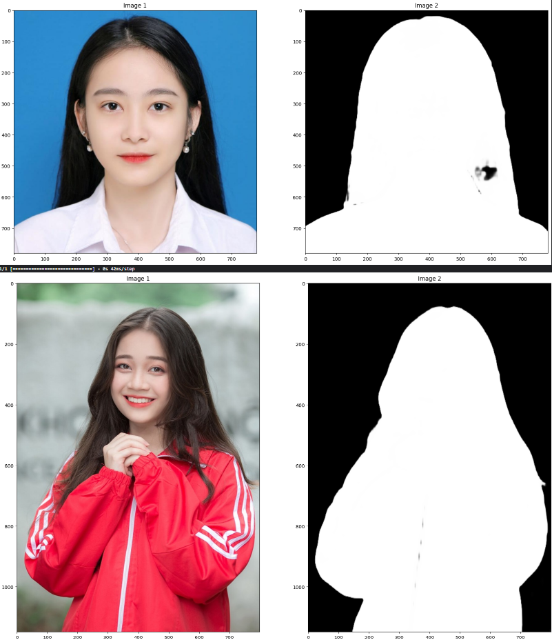
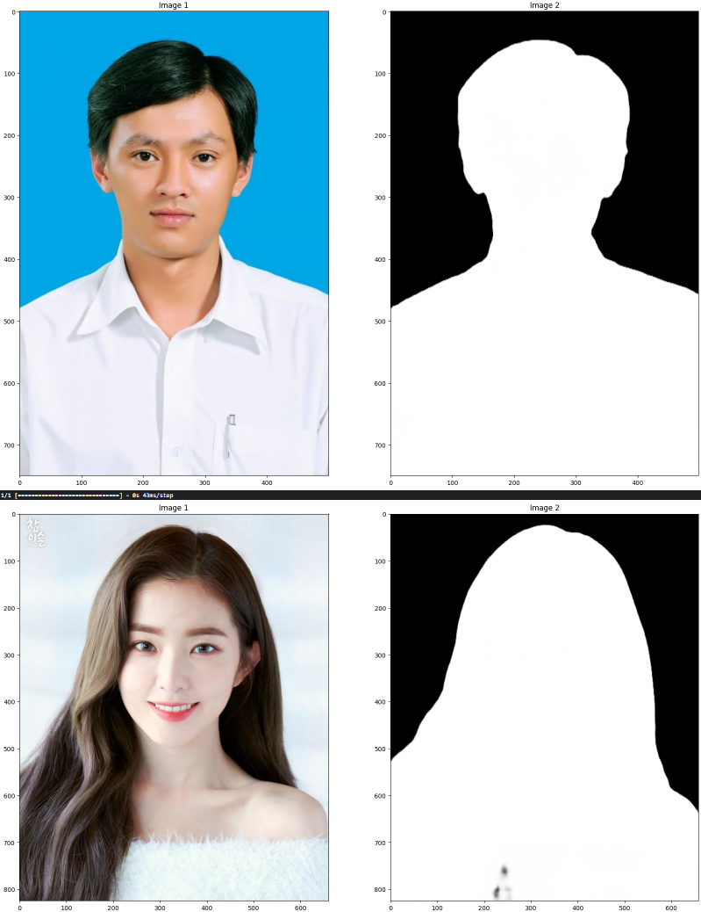

Đây là dự án xây dựng một ứng dụng chỉnh sửa ảnh đơn giản ứng dụng deep learning.

Bao gồm các chức năng cơ bản như cắt, xoay, vẽ lên ảnh, có các filter, và có thể chuyển đổi màu sắc các bộ phận trên khuôn mặt, cùng với đó là thay đổi background. Ngoài ra chương trình cũng có chức năng thêm như chuyển thành ảnh ascii và photomosaic

Dự án đã áp dụng 2 model một là model phát hiện các bộ phận trên khuôn mặt(mắt, tóc, môi ... ) từ đó thay đổi màu sắc theo mong muốn model này train dựa trên kiến trúc Unet và được train trên tập dữ liệu Lapa dataset.

Kết quả:

Model thứ hai là model humansegmentation dùng để tách người ra khỏi nền, model này được train dựa trên kiến trúc Resnet50.
kết quả của hai model có thể xem ở hình dưới

Kết quả:

Loss và accuracy:

Thay đổi màu tóc 

Thay đổi màu môi 

 Thay đổi màu lông mày 

Thay đổi màu mắt 

 Thay đổi nền 
 

